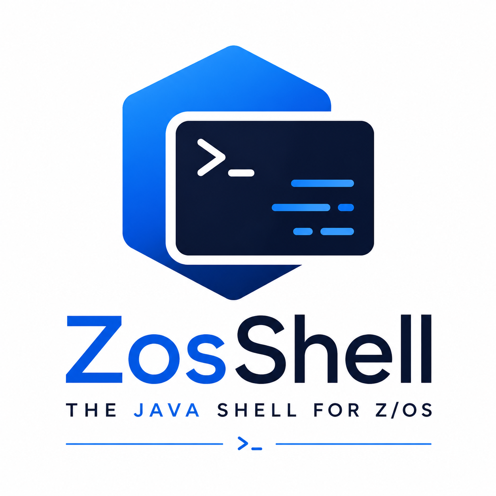

# ZosShell  

<p align="center">
  
</p>

---

## Overview

**ZosShell** provides a Linux-like shell experience for interacting with z/OS system services. It offers a simple, interactive command-line interface for executing common z/OS operations using the z/OSMF REST API layer.

ZosShell behaves similarly to a Bash shell and supports familiar shell concepts such as:

* Command history and history shortcuts (`!`)
* Directory navigation, where directories map to partitioned data sets (PDS)
* Command auto-completion using the **TAB** key
* Cached command output, searchable via a built-in search command

The goal of ZosShell is to provide a more direct and lightweight alternative to **Zowe CLI** for frequently used commands, with less verbosity and faster interaction.

---

## Architecture

ZosShell demonstrates the usage of the **Zowe Client Java SDK**, which provides the underlying plumbing for invoking z/OSMF REST APIs. ZosShell builds on this foundation to expose an interactive shell-style experience tailored for day-to-day z/OS operations.

---

## Supported z/OS Services and Commands

### MVS

* Console command

### TSO

* TSO command

### Member

* copy
* create
* delete
* download
* edit
* list
* rename
* save
* view

### Partitioned Data Set (PDS)

* copy
* create
* delete
* list
* rename
* view

### Sequential Data Set

* copy
* create
* delete
* download
* edit
* list
* rename
* save
* view

### Jobs and Started Tasks

* cancel
* browse log
* download log
* list
* monitor
* purge
* start
* stop
* submit

---

## Platform Support

ZosShell runs reliably on **Windows** and **macOS**.

---
          
## Main Demo  
  


## Increase Font Size Demo


## Download Demo  


## Edit/Save Member Demo   
  

      
---

## Supported Shell Commands

The shell provides a set of **Linux-like commands** for navigating and interacting with z/OS datasets and jobs.

### Standard Commands

```
cat <arg>                       Display member contents
cd <arg>                        Change the working dataset
cls | clear                     Clear the screen and search cache
cp | copy <src> <dst>           Copy files or datasets
echo <arg>                      Print text (expands $VARIABLE)
env                             List environment variables
g | grep <pattern> <member>     Search within output or a member
history [n]                     Display the last n commands
hostname                        Display the connected host
!!                              Repeat the last command
!n | !string                    Repeat a command from history
ls [filter]                     List members or datasets
ls -l [filter]                  Long listing with attributes
mkdir <dataset>                 Create a dataset
ps [filter]                     List started tasks or jobs
pwd                             Display the current dataset path
rm <arg>                        Remove members or datasets
set <key=value>                 Set an environment variable
tail [options] <job>            Display the bottom of job output
touch <arg>                     Create a member if it does not exist
uname                           Display host and z/OS version
unset <arg ...>                 Remove one or more environment variables
usermod <arg>                   Change username (-u) or password (-p)
whoami                          Display the current username
```

---

## Extended (Custom) Commands

The following commands extend the basic shell functionality with z/OS-specific operations:

```
bj | browsejob <job> <opt>      Display JESMSGLG spool output (-a for all)
cancel <job>                    Cancel a started task or job
change <num>                    Switch to a different connection profile
color <prompt> <background>     Set prompt colors
connections                     List configured connections
count <arg>                     Count members (-m) or datasets (-d)
d | download <src> <opt>        Download a dataset or member (-b for binary)
dj | downloadjob [opt] <job>    Download job spool output (-a for all)
e | edit <arg>                  Edit a dataset or member and save changes
end | exit | quit               Exit the shell
files                           List files in the local directory
mvs <cmd>                       Execute an MVS console command
p | purge <job>                 Purge a job or started task from JES
rn | rename <old> <new>         Rename a member or dataset
save <arg>                      Save edits to a file in the working directory
search <pattern>                Search cached outputs
stop <job>                      Stop a started task or job
submit <member>                 Submit a job or started task
t | timeout <val>               Display or set the command timeout
tso <cmd>                       Execute a TSO command
uss <cmd>                       Execute a USS (Unix System Services) command
v | visited                     List visited datasets
```

---

## Keyboard Shortcuts

Key combinations provide enhanced usability within the shell.

> **Note:** All shortcuts work on Windows and macOS unless stated otherwise.

```
CTRL + C            Copy selected text
CTRL + V            Paste copied text
UP Arrow            Scroll backward through command history
DOWN Arrow          Scroll forward through command history
CTRL + UP Arrow     Increase font size (Windows)
CTRL + DOWN Arrow   Decrease font size (Windows)
SHIFT + UP Arrow    Increase font size (macOS)
SHIFT + DOWN Arrow  Decrease font size (macOS)
TAB                 Command auto-completion
```

---

## Exiting the Shell

To exit the shell UI, you may either:

* Click the window **Close (X)** button, or
* Enter one of the following commands:

```
end
exit
quit
```

---

## Help Commands

You can access help directly from within the shell:

```
h | help            List all available commands
help <command>      Display detailed help for a specific command
```

---

## Requirements

* **Java 11 or later**
* **z/OSMF** installed and configured on the target z/OS system

---

## Build And Execute  
          
At the root directory prompt, execute the following maven command:  
  
    mvnw clean install  
  
Change the directory to the target directory and execute the following command:  
  
    java -jar zosshell-5.0.3.jar   
  
Since version 3.0.0, you can send an argument value to the java command above, for instance:  
  
    java -jar zosshell-5.0.3.jar 2  
  
This will load the third profile defined in config.json at startup instead of the first one, which is done by default.  

Indexing value starts at zero. 
  
If you are planning to browse large job output, you may want to set the JVM memory usage higher than the default, i.e.  
  
    java -jar -Xmx2G zosshell-5.0.3.jar   
  
### Terminal configuration properties
  
By default, the configuration file name is config.json located within C:\ZosShell directory for Windows or /ZosShell for macOS.  
  
You can override the default file name and its location by setting the following OS environment variable:  
  
    ZOSSHELL_CONFIG_PATH  
  
The configuration file consists of JSON data. The configuration JSON string is defined as a JSON array structure. The array will consist of one or more profile(s).
  
A profile is a one-to-one relationship of the [Profile.java](https://github.com/Zowe-Java-SDK/ZosShell/blob/master/src/main/java/zos/shell/singleton/configuration/model/Profile.java) file within the project. It contains variables as a placeholder for configuration information, such as z/OSMF and SSH connection information, properties to control the Window environment and much more.  
   
The first JSON array entry in the example below shows all the attributes defined to be read by the application.  
  
The other JSON array entries show that you don't need to specify all attributes and its values. The attributes required are those that specify a z/OSMF connection: hostname and zosmfport.    
   
The username and password entries are optional. It is recommended to not specify those settings. When not specified, the application will prompt the end user for a username and password for the current connection.   
    
For further details on username and password usage, see [here](https://github.com/Zowe-Java-SDK/ZosShell/issues/182).    
    
Example of config.json:  

    [
        {
            "hostname": "xxxxxxxxx",
            "zosmfport": "xxxx",
            "sshport" : "xxxx",
            "username": "",
            "password": "",
            "downloadpath": "/ZosShell",
            "consolename": "",
            "accountnumber": "12345",
            "browselimit": "",    
            "prompt": "$",
            "window": {
                        "fontsize": "xxx",
                        "fontbold": "xxxxx",
                        "textcolor": "xxxx",
                        "backgroundcolor": "xxx",
                        "paneHeight": "xxx",
                        "paneWidth": "xxx"
                      }		
        },
        {
            "hostname": "xxxxxxxxx",
            "zosmfport": "xxxx",
            "sshport" : "xxxx",
            "downloadpath": "C:\\ZosShell3",
            "consolename": "",
            "accountnumber": "",
            "browselimit": "",   
            "prompt": "",
            "window": {}		
        },
        {
            "hostname": "xxxxxxxxx",
            "zosmfport": "xxxx",
            "sshport" : "xxxx",
            "downloadpath": "C:\\ZosShell",
            "consolename": "",
            "accountnumber": "",
            "browselimit": "1000",   
            "prompt": "$(hostname)",
            "window": {}		
        }
    ]
  
Explanation of some of the variable settings:
  
    downloadpath specifies the location on your disk drive to store downloaded data
    consolename specifies the console name to use to perform MVS console command
    accountnumber specifies the account number needed to perform TSO command
    prompt specifies value to display for the application prompt
    window is a subsection specifies values to control the application window settings
  
NOTE: The following are the default values for paneHeight (480) and paneWidth (640); values lower than these are ignored, and the default(s) is used instead.  
   
The following JSON variable settings are converted into environmental variables within the shell:
  
    hostname as HOSTNAME
    downloadpath as DOWNLOAD_PATH
    consolename as CONSOLE_NAME
    accountnumber as ACCOUNT_NUMBER
    browselimit as BROWSE_LIMIT
    prompt as PROMPT
  
Each of these environmental variables will appear at app startup via ENV command if any have a value specified within the configuration JSON file.

Use SET command to define or change each environmental variable noted above as needed, and the new settings will be used by the application accordingly.
  
<b>PROMPT</b> setting controls what the shell prompt value should represent. By default, the prompt value is ">."  
  
A prompt can be set and changed directly with the SET command. It can parse other ENV variables' value to use within its prompt value.  
  
For example:  
  
    > env
    DOWNLOAD_PATH=/ZosShell
    HOSTNAME=hostname1
    > set prompt=$(hostname)
    prompt=$(hostname)
    hostname1> set prompt=start$(info)
    prompt=start$(info)
    START$(INFO)> set info=with
    info=with
    STARTWITH> 
  
JSON configuration file is required for the application to work properly. Any error in finding the file or parsing the JSON string will result in the application being unusable; it will display an error, and any input will close the app.    
    
The following screenshot displays the ZosShell shell window with custom windows properties defined within the "window" JSON section.  
  
Here the window is set to display its background in green and font as yellow/bold.  
  
    

## Troubleshooting
    
Logging framework logback is configured for the project. Logback configuration is located under src/main/resources/logback.xml.  
    
It is configured to produce output logging while the application is running under the running directory where the application was kicked off.
      
You are free to change configuration accordingly for your needs.  
  
